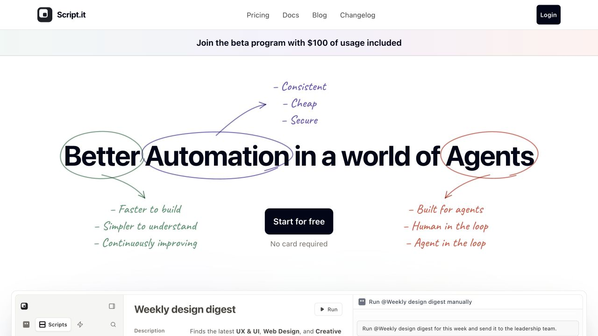
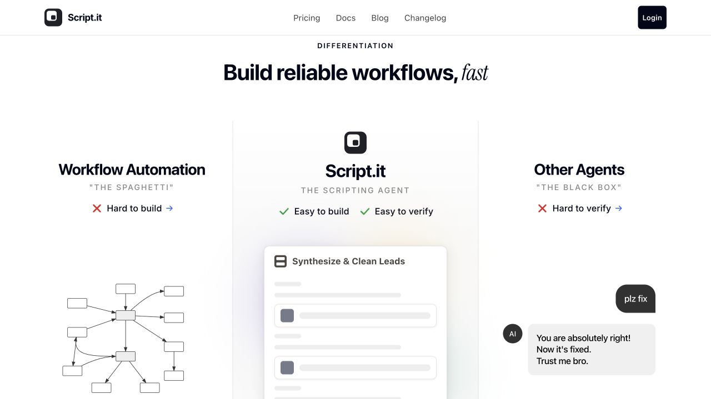
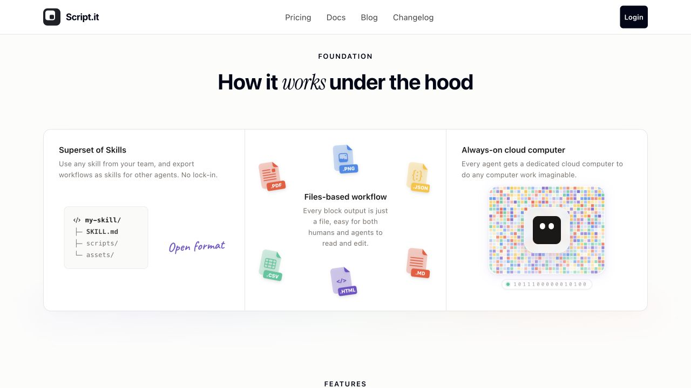
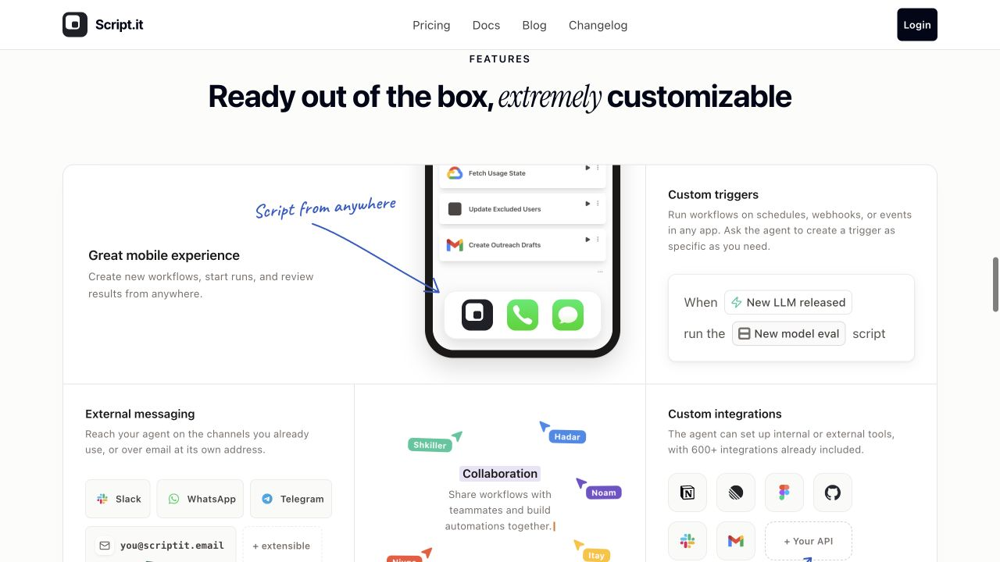
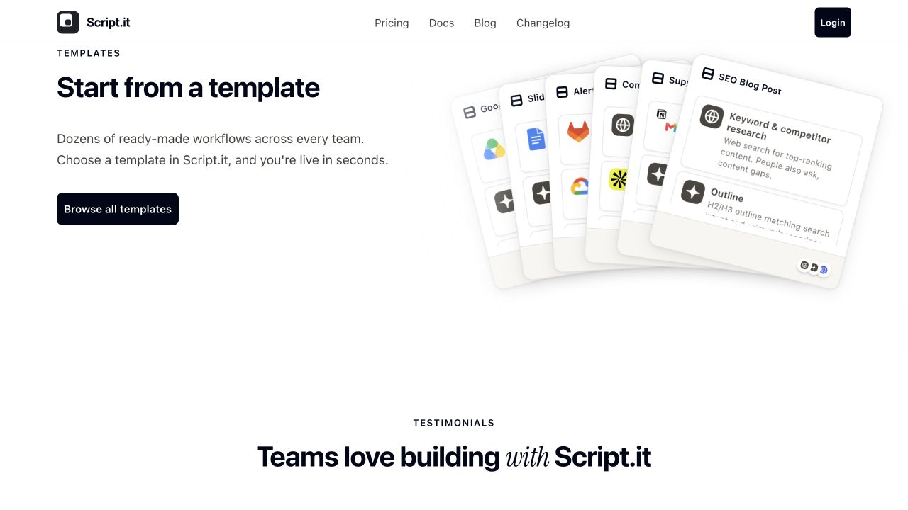
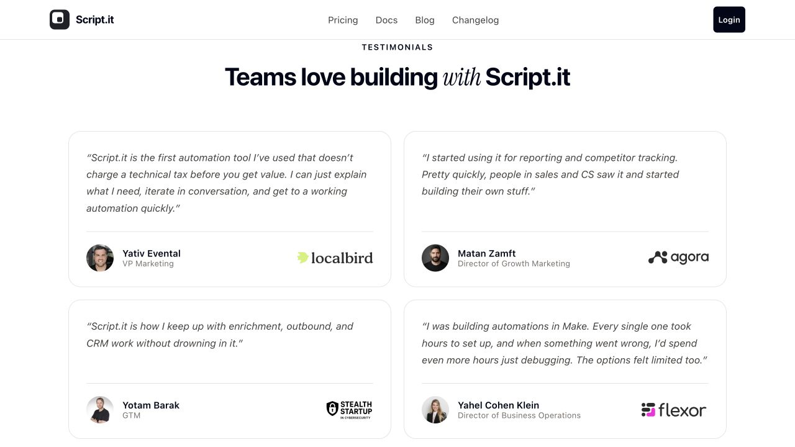

# Script.it: design, messaging, and the Cabinet response

**Purpose:** competitive teardown of Script.it, focused on why its homepage feels more professional and easier to understand than the current Cabinet homepage.
**Captured:** 2026-07-18 at 1280 × 720.
**Primary sources:** [homepage](https://script.it/), [templates](https://script.it/templates), [pricing](https://script.it/pricing), and [about](https://script.it/about).
**Screenshots:** `docs/design-research/scriptit-*.jpeg`.
**Companion docs:** `DESIGN.md`, `TOWN.md`, `docs/brand-guide.md`, and `docs/prd-world-class-website.md`.

---

## 1. Executive read

Script.it sells AI-powered workflow automation to business teams. The site has one job: make a non-technical buyer believe they can describe a recurring process, turn it into a reliable automation, and verify what it does.

The page feels more professional than Cabinet for five reasons:

1. **One category sentence owns the hero.** The visitor sees the category, the difference, one action, and the product itself.
2. **Every section answers one buyer question.** What is it? Why is it different? How does it work? What can it handle? Has anyone used it?
3. **The product is the main visual evidence.** Decoration annotates the product. It never replaces it.
4. **The comparison creates a memorable wedge.** Traditional automation is difficult to build. General agents are difficult to verify. Script.it claims the middle: easy to build and easy to verify.
5. **The copy is concrete.** Workflows, files, triggers, integrations, channels, and outputs are named directly.

The lesson for Cabinet is not to become a black-and-white automation site. The lesson is to make the message as disciplined as the product is ambitious.

## 2. Screenshot set

### 2.1 Hero: one thesis, one action, one live product

The hero uses the line **“Better Automation in a world of Agents”** as a compact category thesis. Handwritten annotations explain what each part means, while the live product enters the first viewport. There is one primary action and a small risk-reversal line beneath it.

What matters:

- The H1 is one line at 1280px.
- The product starts before the fold ends.
- The annotation system carries secondary benefits without adding a paragraph.
- The header has four informational links and one account action.
- The white field gives the product frame and handwriting all the attention.

### 2.2 Differentiation: the market explained in one screen

The heading **“Build reliable workflows, fast”** leads into a three-way comparison. The two alternatives each have one recognizable failure mode. Script.it owns the center and gives itself two plain benefits.

This is stronger than a long feature grid because it tells the buyer why the category needs another product.

### 2.3 Foundation: the mechanism behind the promise

Only after the benefit and category contrast are established does the site explain the system. Three ideas carry the section:

- Workflows use an open skill format.
- Outputs remain readable files.
- Each agent receives a persistent cloud computer.

The section is technical, but the language stays at buyer altitude. Each idea is paired with one diagram and one short explanation.

### 2.4 Features: concrete surfaces, not abstract capabilities

The feature promise is **“Ready out of the box, extremely customizable”**. The grid then shows how that becomes real: mobile access, triggers, external messaging, collaboration, and integrations.

The visual hierarchy is especially effective:

- One large mobile product object anchors the grid.
- Every card has a clear title and a short result statement.
- Recognizable app logos reduce explanation time.
- Handwritten labels point to the evidence rather than decorating empty space.

### 2.5 Templates: readiness shown as real work

The template section converts “ready-made” from a claim into a visible stack of workflows. On the template library page, filters are organized by team: Marketing, Operations, Product, Data, R&D, and Sales. Each template shows a business result, the stages of work, and the systems it touches.

The homepage does not explain every template. It proves breadth, gives one sentence of context, and offers a clear route into the library.

### 2.6 Proof: recognizable roles and specific use cases

The testimonials come after the product, differentiation, mechanism, features, and templates. This order matters. Customer proof validates a story the visitor already understands.

The quotes are credible because they name work such as reporting, competitor tracking, enrichment, outbound, CRM maintenance, and debugging. Company logos and senior role labels make the evidence scannable.

## 3. The homepage narrative

| Beat | Buyer question | Script.it answer | Evidence used |
|---|---|---|---|
| Header | Where am I and where can I go? | A small product navigation with pricing, documentation, updates, and account access | Five visible actions |
| Beta strip | Is there a reason to act now? | A time-bound offer with included usage | Simple promotional band |
| Hero | What is this? | A better form of automation designed for an agent-driven market | Annotated H1 and live product |
| Product demo | What does using it feel like? | A workflow is visible as inputs, assets, steps, execution, and result | Full product surface |
| Differentiation | Why not use existing tools? | Visual builders are hard to construct; general agents are hard to inspect | Three-column comparison |
| Foundation | Why should I believe it works? | Open skills, readable files, and a persistent execution environment | Three architecture cards |
| Features | Can it fit our operation? | It runs from multiple surfaces, supports triggers, connects tools, and enables shared work | Structured feature grid |
| Templates | How quickly can we get value? | Start with a recognizable workflow organized by team | Template stack and library |
| Testimonials | Has this worked for teams like mine? | Operators use it for real go-to-market and operations work | Named people, roles, and companies |
| FAQ | What objections remain? | Plain answers about coding, integrations, pricing, and data handling | Expanded questions |
| Final CTA | What should I do next? | Begin without procurement friction | One action and a short risk reversal |

The order moves from outcome to proof to mechanism. Cabinet currently asks the visitor to understand more of the product model before the central contrast is fully established.

## 4. Why the messaging is clearer

### 4.1 The category is familiar before the product becomes novel

“Automation” is a known budget and a known job. “Agents” changes how that job is delivered. The visitor does not need to learn two new categories at once.

Cabinet currently leads with AI teams, business workflows, company knowledge, model providers, ownership, and durable results in the first viewport. Every point is valid, but their combined weight makes the hero feel like a summary of the whole page.

For Cabinet, the familiar anchor should be **company workflows**. The novel mechanism is **AI teams in an owned workspace**.

### 4.2 The copy names a tension, not a list of capabilities

Script.it defines itself between two bad tradeoffs. That contrast makes its existence feel necessary. The visitor can repeat the story after one screen.

Cabinet has an equally strong contrast available:

| Existing choice | Useful property | Limitation |
|---|---|---|
| Chat assistants | Easy to ask | Context and results disappear into sessions |
| Automation builders | Predictable execution | Slow to build and difficult for most teams to change |
| Cabinet | AI teams, company context, visible work, and recurring jobs | New operating model that needs a clear demonstration |

The homepage should state this tension once. The product should prove it everywhere else.

### 4.3 Benefits and mechanisms do not compete in the same sentence

Script.it separates its layers:

1. Category benefit
2. Competitive contrast
3. Technical foundation
4. Operational features
5. Ready-made workflows

Cabinet often combines those layers. A sentence may explain agents, knowledge, files, providers, ownership, and business results together. The result is accurate but harder to scan.

### 4.4 Every large claim receives a receipt

- Reliability gets a visible execution graph.
- Readability gets file outputs.
- Extensibility gets integrations and a custom API slot.
- Availability gets mobile and messaging surfaces.
- Fast time to value gets templates.
- Adoption gets named customers and roles.

Cabinet should use the same evidence discipline. If a section claims the whole company becomes navigable, show the actual directory. If it claims a team can run customer operations, show the team, cadence, connected systems, and output.

### 4.5 The vocabulary remains consistent

Script.it repeatedly uses a small set of nouns: workflow, script, agent, file, trigger, integration, template, and result. The visitor learns the product language once.

Cabinet currently rotates among AI team, cabinet, workspace, knowledge, files, sources, apps, workflows, jobs, agents, and company systems. All are real product concepts, but the homepage needs a smaller public vocabulary.

Recommended homepage vocabulary:

- **AI team:** who does the work
- **Workflow:** the business result being run
- **Company Cabinet:** where knowledge, files, apps, and results live
- **Connected systems:** where context comes from and actions happen
- **Approval:** where a person keeps control

Use “agent,” “job,” “skill,” and provider-level detail only after this foundation is understood.

## 5. Visual system

These values were measured from the live homepage at 1280 × 720.

| Element | Observed treatment | Why it works |
|---|---|---|
| Body | System sans, 18px, 26px line height, near-black on white | Familiar, fast, and neutral |
| H1 | About 60px, weight 700, tight negative tracking, one line | Strong without becoming theatrical |
| H2 | 40px, weight 700, tight tracking | Clear section hierarchy |
| Primary CTA | 56px high, near-black fill, 10px radius | Reads as a product control, not a decorative pill |
| Header | 64px high, translucent white | Quiet and persistent |
| Section width | Roughly 1120px of usable content | Dense enough for product proof, restrained enough for calm |
| Palette | White, near-black, light gray, functional green/red, selective blue/purple handwriting | Decoration has a role and never becomes the background |
| Borders | Thin neutral lines around structured product and card areas | Communicates containment without heavy chrome |
| Motion | Product-led reveals and small annotations | Motion supports comprehension rather than spectacle |

The page's distinctive risk is the handwritten annotation layer. It humanizes a technical product and turns feature explanation into visual editing marks. The rest of the system is intentionally quiet so that risk feels controlled.

## 6. What Cabinet should borrow

### 6.1 Borrow the editorial discipline

- One idea per section.
- One dominant visual per section.
- One or two supporting sentences.
- One primary action per viewport.
- Product evidence beside every important claim.
- Familiar business language before product architecture.

### 6.2 Borrow the contrast, translated to Cabinet

Cabinet needs one compact section that explains why chat alone and brittle automation are not enough. It should not copy Script.it's three columns or its wording. A Cabinet-native expression could show a request becoming durable company work:

1. A request enters from a person or recurring schedule.
2. An AI team receives company context and clear roles.
3. Work lands as files, decisions, data, and live apps that the company keeps.

This communicates Cabinet's wedge without turning the homepage into a competitor comparison page.

### 6.3 Borrow the product-first hero

The live Cabinet mockup is the right hero visual. It should become calmer and more legible:

- Keep the Sources directory expanded.
- Show one selected workflow and one visible result.
- Remove any supporting motion that competes with reading.
- Let the product occupy the larger column.
- Use one primary action and one restrained secondary text link.

### 6.4 Borrow the evidence structure for templates

Each Cabinet outcome should show the same five fields in the same order:

1. Business result
2. AI team roles
3. Operating cadence
4. Connected systems
5. Result produced

The outcome explorer already contains most of this. Its next refinement should reduce simultaneous detail and make the result the strongest label.

## 7. What Cabinet should not copy

1. **Do not replace Cabinet's identity with monochrome minimalism.** The parchment, wood, sage, and crafted-object system is recognizable. Keep it, but use less of it at once.
2. **Do not copy the handwritten circles and arrows.** Cabinet can use its hand face for one review note or human-approval annotation, but Script.it owns the classroom-markup composition.
3. **Do not adopt automation as Cabinet's entire category.** Cabinet also organizes company knowledge, renders live apps, preserves work, and supports collaboration.
4. **Do not copy claims Cabinet cannot support.** External messaging, integration counts, cloud execution, and compliance claims must reflect the real product state.
5. **Do not turn every section into a bento grid.** Script.it earns the grid because it explains discrete product surfaces. Cabinet should use the directory, the outcome explorer, and live views as its own structural language.

## 8. Recommended Cabinet message hierarchy

### 8.1 Hero

**Eyebrow:** AI teams for company workflows

**H1:** Run company workflows with AI teams you control.

**Supporting copy:** Start with a working team for content, customers, sales, meetings, or operations. Connect company systems, set approvals, and keep every file, decision, and result in one workspace your company owns.

**Primary action:** Explore AI teams

**Secondary action:** See the product

**Proof line:** Open source · Self-hosted · Works with Claude, GPT, and Gemini

Why this is clearer:

- “Company workflows” names the familiar job.
- “AI teams” names the new mechanism.
- “You control” introduces the ownership difference without explaining infrastructure.
- The support copy moves from outcomes to systems to governance.

### 8.2 First section: choose the result

**Section label:** Working AI teams

**H2:** Start with the result you need.

**Body:** Choose a working team, connect the systems it needs, and inspect exactly how the work runs.

The current outcome explorer remains the right first section. It should lead with fewer visible rows, a shorter selected-result headline, and a clear indication that the list continues without clipping the panel.

### 8.3 Second section: establish the difference

**Section label:** Durable company work

**H2:** The work stays useful after the chat ends.

**Body:** Cabinet gives every team a visible place to work. Files, decisions, data, and live apps remain organized for the next person and the next run.

Evidence: show one workflow request becoming a structured set of outputs inside the Company Cabinet.

### 8.4 Third section: show the whole company

**Section label:** Connected company knowledge

**H2:** See the whole company.

**Body:** Files, pages, code, data, and live apps sit in one navigable place, with cloud systems and local work visible together.

Evidence: the expanded Sources directory and the coordinated Knowledge, AI team, and Work views.

### 8.5 Control belongs inside the product story

Do not ship a standalone approval section. It repeats the AI-team story without adding enough new evidence. Show approvals, connected accounts, outputs, and history inside the outcome explorer and product views where they have context.

### 8.6 Fifth section: provider choice

**Section label:** Bring your own AI

**H2:** Use the models your company already trusts.

**Body:** Connect Claude, GPT, Gemini, or local models. Choose the right provider for each team without moving company work into another closed workspace.

Evidence: the provider network and a simple per-team selection state.

### 8.7 Proof and conversion

Customer proof should follow the product story. Keep each quote tied to a recognizable result, then end with one conversion band for download and one route to an executive demo.

The final brand line can carry more personality, in the same way Script.it ends with **“Humans should work off script.”** Cabinet's equivalent should come from ownership and durable company memory, not from automation wordplay.

## 9. Copy rules for the redesign

1. H1 states the category and difference in one sentence.
2. H2 states one buyer outcome, usually in seven words or fewer.
3. Body copy is no more than two sentences before evidence appears.
4. Use the five public nouns from §4.5 consistently.
5. Never place more than two CTAs in one viewport.
6. Avoid stacking three abstract concepts in one sentence.
7. Replace adjectives with a product receipt.
8. Keep technical mechanisms below the outcome they support.
9. Name readiness honestly. Planned workflows remain clearly marked.
10. Keep Cabinet's entire product in view: knowledge, files, live apps, collaboration, AI teams, and company ownership.

## 10. Recommended implementation order

### P0: clarity

1. [x] Replace the hero copy with the hierarchy in §8.1.
2. [x] Reduce the hero to one calm product state with manual product tabs.
3. [x] Shorten the outcome explorer's section title and selected-result copy.
4. [x] Add the durable-work contrast directly after the first product proof.
5. [x] Limit every following section to one message and one product receipt.

### P1: professional polish

1. [x] Reduce decorative gradients and continuous looping motion.
2. [x] Reduce operational section headlines while preserving the serif hero.
3. [x] Use the warm Cabinet palette on a mostly quiet field.
4. [x] Standardize card titles, body lengths, system chips, and result labels.
5. [x] Keep the homepage section snap behavior subtle and proximity-based.

### P2: proof

1. Add outcome-specific customer evidence.
2. Link every available AI team to an inspectable cabinet.
3. Show one end-to-end run with inputs, approval, output, and history.
4. Add security and ownership receipts only where the product can substantiate them.

## 11. Bottom line

Script.it feels clear because it edits aggressively. The product remains broad, but the page reveals that breadth one buyer question at a time.

Cabinet should keep its richer product story and its distinctive material identity. The redesign opportunity is to make the sequence stricter: workflow first, AI team second, visible company work third, ownership and provider choice after the value is understood. That gives Cabinet Script.it's clarity without making Cabinet look or sound like Script.it.
